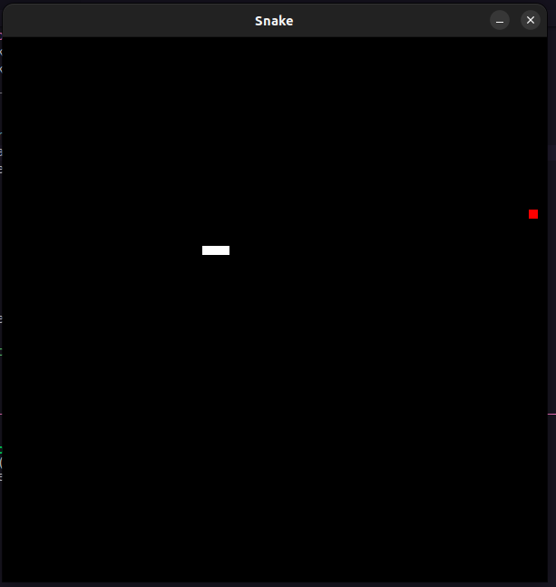

# Snake Game 🐍

Projeto inicial para a criação de um jogo snake usando apenas python, acompanhando o canal do Youtube codificando

[🔗Clique aqui para acessar](https://www.youtube.com/c/CodificandoTech)

## 🧑‍💻 Tecnologias e bibliotecas

- Python
- Pygame
- Git e Github

❤️ Contato

- anderson.solon@gmail.com
- LinkedIn - https://www.linkedin.com/in/anderson-solon-20069342/
